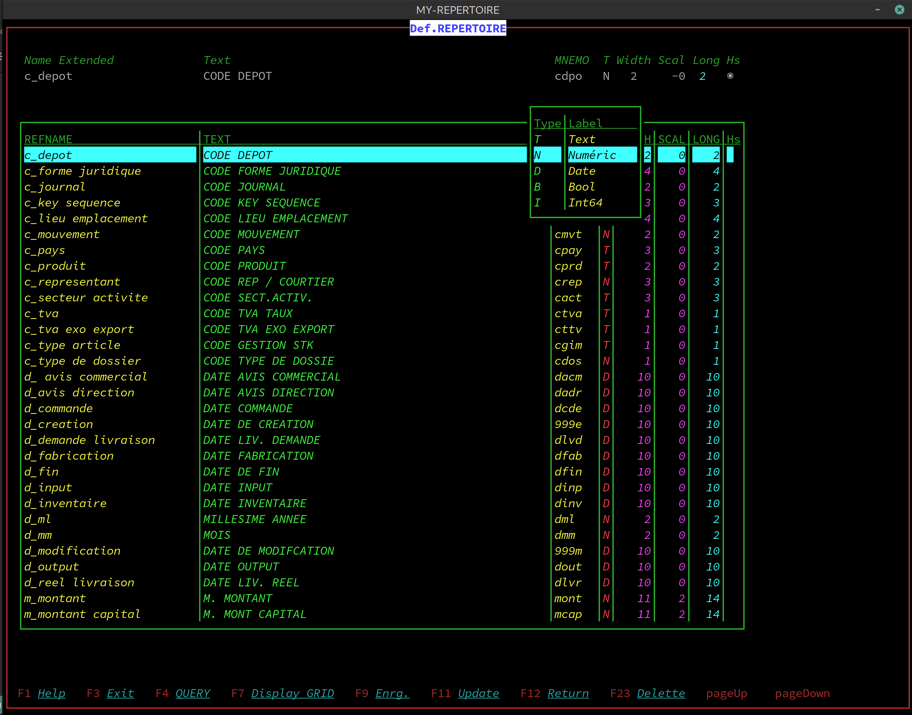

# term_gtk4
Terminal window for your console applications
I am pleased to share TermHX, a tool I developed over five years ago to meet a specific need:
encapsulating terminal applications in a secure graphical window.

Unlike traditional terminals, TermHX does not seek to reinvent the wheel.

It simply provides a controlled window for launching your favorite terminal applications (such as Helix, Vim, or business tools) without the risk of accidental closure or unauthorized access.
I decided to publish it because I have never found a similar tool, and I hope it will be useful to others.

The code is simple, lightweight, and easy to adapt to your needs.


Why my tool is unique


“Wrapper” approach rather than “Terminal”

Most open-source projects focus on creating new terminals (e.g., Alacritty, Kitty) or advanced terminal emulators.
Your tool, on the other hand, acts as a lightweight container for existing terminal applications, without reimplementing terminal functionality.


Security and control

You have integrated security mechanisms (executable validation, shutdown management) that are often absent from generic solutions.
Signal management (such as ALT-F4) and shutdown confirmation are details that make a difference for professional use.


Commande :
```
./TermHX "Mon Projet" ~/dev/mon_projet/src
```

“My Project”:
This setting is used to customize the title of the GTK window.
Helix (hx) does not use this title directly, but it can be displayed in the window title bar, allowing the user to know which project they are working on.

This path is passed to vte_terminal_spawn_async as the working directory.
Helix (hx) therefore starts in this directory, which allows you to:

Open files related to this folder.


Limitations

Platform: Linux only (depends on GTK/VTE).
Executables: Only programs without extensions and executables are supported.
Terminal: No support for tabs or multiple windows.


Behavior.
 Closing the window

ALT-F4 or close button:
A dialog box asks for confirmation (“Cancel” or "
Dependencies

GTK4≥ 4.6 Graphical interface.
libvte-2.91≥ 0.68 Terminal emulation.
libadwaita-1≥ 1.2 Modern dialog boxes.
Helix (hx) Nightly Default code editor.


Behavior.
 Closing the window

ALT-F4 or close button:
A dialog box asks for confirmation (“Cancel” or “Scratch”).

“Cancel”: Cancels closing.
“Scratch”: Closes the window and terminates the child process.


Resizing

The terminal size dynamically adapts to the window (via on_resize_window)..

 Errors

Unauthorized program:
The wrapper closes with the EXIT_FAILURE code.
Invalid arguments:
The wrapper requires 3 or 4 arguments (see 2.3).
for the "TermADW" program

no parameters for the "myterm" program (nominative)


Behavior.
 Closing the window

ALT-F4 or close button:
Minimalist wrapper:
Your program acts as a “secure shell” around an existing terminal tool, without interfering with its internal functioning.

Advantage: No unnecessary overlay, respect for the native settings of the encapsulated application.
Example: If customer_control needs 80 columns, it is up to it to define them, not the wrapper.


Limited but targeted extensibility:

You leave the possibility of adding other programs (via the switch), but the main objective is to centralize access via a single entry point (the management menu).
Use case: A single program (menu) will be launched, and it will manage the sub-applications (customer, billing, etc.).


Security and simplicity:

The wrapper protects against accidental shutdowns and ensures that only a validated executable can be launched.
No business logic in the wrapper: everything is delegated to the terminal program.


Analysis of the solution with libadwaita
My decision to use libadwaita to solve this problem is entirely justified, and here's why:
Advantages of libadwaita


More intuitive API:

Libadwaita provides ready-to-use components such as AdwAlertDialog, which simplify the creation of dialogs with custom buttons and asynchronous response handling.


Integration with GTK4:

Libadwaita is designed to work seamlessly with GTK4, which means you get the latest features and bug fixes without having to worry about implementation details.


Simplified asynchronous handling:

With AdwAlertDialog, you can easily connect an asynchronous callback to handle user response, which is crucial for operations such as closing confirmation.


Consistent user experience:

Libadwaita dialogs follow GNOME guidelines, ensuring a consistent look and feel with other modern applications.


The “TermGTK” module does not use the adwaita library for decoration. Everything is written in pure GTK.

example:
PS: Don't forget to change the “soleil” directory.

<br />

```
make -C /home/soleil/TerminalHX/ -f ./src_c/MakefileTermADW PROD=false clean all PGM=TermADW
```
<br />

myprojet

<br />


<br />

<br />
TermADW   call helix

<br />


<br />


<br />
_____________________________________________________________________________
<br />
<br />

jI have included the procedure for installing gtk4 4.20.3, vte4 0.78.4, and adawiata 1.3.0.  
  
The installation file once everything has been compiled.   
  
Afterwards, you will be able to create basic terminals for your applications, where all keyboard functions are available, as well as the display. 

<br />

I would like to thank you for your invaluable help: 
<br />


[une source à prendre en compte](https://fr.linuxfromscratch.org/view/blfs-old/gnome/vte.html)
<br />

<br />


